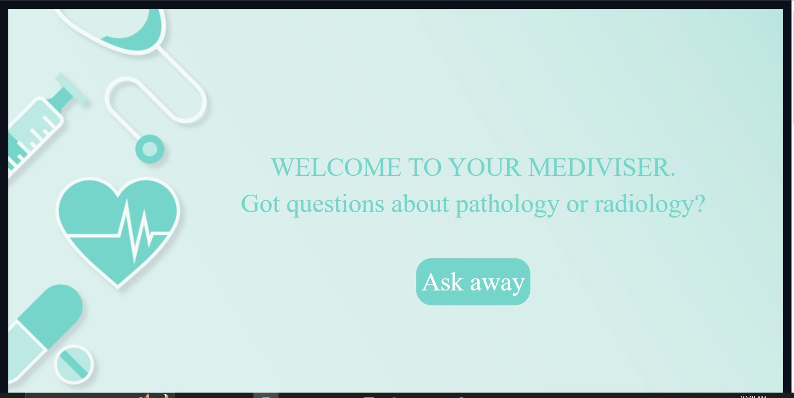
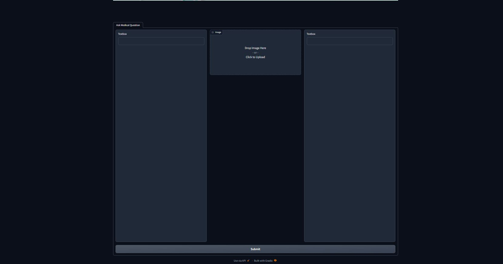

<h1 align="center" style="font-weight: bold;">MEDIVISER</h1>

A interactive multimodal visual question answering app for medical images

---

</img>

  
Gradio Interface

  
</img>

## **DEMO**

1. For DEMO, you can use the kaggle notebook at [https://www.kaggle.com/mananapeejay/final-competition-hackcog](https://www.kaggle.com/mananapeejay/final-competition-hackcog)

## **🔌API**

- The gradio app can we used for the api as well

## **💕Contributing**

- The project is open for contributions. You can make an issue or assign yourselves one and then can start working on it. The project uses pytorch, transformers and gradio. While making a pull request, make sure to pr to the dev branch rather than the master branch.

# **Happy Hacking!**
If you liked this project, please leave a 🌟
